# 🎯 SmartFocus (Addiction Reduction App)

**SmartFocus** is a premium, high-performance, and beautifully designed Android application engineered to combat digital addiction, boost productivity, and help users reclaim their screen time. Utilizing advanced native Android APIs and Google’s state-of-the-art **Gemini 2.0 Flash AI**, SmartFocus delivers active blocking, real-time analytics, habit-tracking, gamified achievements, and a personalized digital coach.

---

## 📸 Application Screenshot & Interface Design
The user interface is designed with a premium, high-fidelity dark aesthetic (**Dark Mode**), modern typography (Outfit/Inter styled), vibrant tailored color gradients (Teal, Purple, Orange), glassmorphism details, and spring-based micro-animations for an elegant, responsive user experience.

```
+---------------------------------------------------------+
|                  WELCOME BACK, SUJAL          [FOCUS%]  |
|                                                [ 87% ]  |
|                      REMAINING                          |
|                       04h 32m                           |
|                       (On Track)                        |
|                                                         |
|                 [ START DEEP FOCUS ]                    |
|                                                         |
|  [Blocked: 2]   [Streak: 5 days]   [Usage: 1h 20m]  ... |
|                                                         |
|  +---------------------------------------------------+  |
|  | Arjuna says: "Master your habits, master life!"   |  |
|  +---------------------------------------------------+  |
|                                                         |
|  [Home]      [Timer]      [Stats]      [Coach]   [Set]  |
+---------------------------------------------------------+
```

---

## 🌟 Key Features & Core Components

1. **User Authentication & Animated Onboarding**
   - Premium login and registration flows with custom validations.
   - A multi-page, gesture-driven horizontal pager welcoming users with ambient radial glow indicators and page-specific primary buttons.

2. **Core Dashboard (Home Screen)**
   - **Focus Score Metric:** Real-time calculation representing your efficiency (`(1 - usageProgress) * 100`).
   - **Animated Circular Progress:** Custom canvas-rendered remaining usage visualizer displaying exactly how much allowed screen time remains.
   - **Comprehensive Metrics:** Interactive stats widgets showing Apps Blocked, Current Day Streak, Daily Usage time, and completed Focus Sessions.
   - **Dynamic Daily Insight:** Automated alerts reminding you to stay on track or take corrective action.

3. **Deep Focus Timer & Ambient Spaces**
   - Customizable study durations (15m, 25m, 45m, 60m, 90m, 120m) displayed in an active radial countdown dial.
   - Integrated atmospheric audio profiles (Rain, Forest, Cafe, Lo-fi, Silence).
   - **Lock Mode:** A strict focus option disabling standard pauses and stops until the countdown finishes, prompting high-discipline sessions.
   - **Gamified Completion:** Beautiful trophy screens celebrating finished sessions, auto-incrementing streaks and total minutes.

4. **Advanced App Blocker**
   - Active tracking toggles for monitored platforms (Instagram, TikTok, YouTube, WhatsApp, Reddit, Netflix, and more).
   - Precision daily minute limit sliders (1 to 180 minutes).
   - **Custom Blocking Schedules:** Hourly constraint sliders enabling strict curfew/blocking windows (e.g., 9:00 AM to 5:00 PM).
   - **Dynamic Exclusions:** Secure one-tap whitelisting for critical applications.

5. **Real-time Screen Time Analytics**
   - Deep integration with Android's `UsageStatsManager`.
   - Continuous 15-second background polling during active view states.
   - Categorized metrics showing Distracting screen time vs Productive focus minutes.
   - Multi-period tabs (**Today**, **Weekly**, **Monthly**) with customizable dual-gradient Canvas bar charts representing historical trends.

6. **Arjuna — The AI Focus Coach**
   - A personalized digital mentor named after the legendary archer of focus and discipline.
   - Directly powered by the **Google Gemini 2.0 Flash SDK** (zero latency, zero intermediate API brokers).
   - The chatbot uses rich context injections, including the user's name, active streak count, focus sessions completed, and most distracting apps.
   - Designed with stylized bubble chat boxes, typing states, and high-importance quick reply action prompts.

7. **Gamified Achievements**
   - Gamified badges with real-time percentage indicators tracking milestones (e.g., "First Focus", "On Fire 3-day Streak", "Hour Hero", "Dedicated trophy").

---

## ⚙️ Background Processes & System Architecture

SmartFocus operates robust native background workers to actively monitor the OS environment, intercept distractions, and deliver notifications without consuming excess system resources or battery.

### 1. Active App Blocker Service (`AppBlockService`)
Operating as an Android `AccessibilityService`, this component maintains a low-footprint loop to check the foreground app state.

#### How It Works:
```mermaid
flowchart TD
    A[User Opens an App] --> B{Accessibility Event / TYPE_WINDOW_STATE_CHANGED?}
    B -- Yes --> C[Extract active Package Name]
    B -- No --> D[Poll via checkRunnable every 2s]
    D --> C
    C --> E{Package in Whitelist?\n(SmartFocus, SystemUI, Launchers, Settings)}
    E -- Yes --> F[Ignore & Keep Monitoring]
    E -- No --> G{Cooldown Active?\n(<3s since last block)}
    G -- Yes --> F
    G -- No --> H{Read regain_prefs SharedPreferences\n(focus_mode_active, selected, limitMinutes, schedule)}
    H --> I{Is Block Constraint Met?\n1. Focus Mode Active\n2. Daily Limit Exceeded\n3. Scheduled Hours Active}
    I -- No --> F
    I -- Yes --> J[Trigger Cooldown & Reset lastActivePackage]
    J --> K[Perform Global Action: HOME\n(Minimizes App)]
    K --> L[Launch Overlay MainActivity\nwith show_block_screen = true]
    L --> M[Display customized BlockScreen]
```

#### Core Safeguards:
- **Comprehensive Whitelist:** Ensures standard system operations like `com.android.systemui`, device launchers (Xiaomi, Samsung, Pixel, etc.), and system settings are strictly whitelisted to prevent device bricking or deadlock loops.
- **Loop Prevention Cooldown:** Implements a strict 3-second lock timer to prevent duplicate overlays when launching home screens.
- **Accessibility Actions:** Employs the highly reliable `performGlobalAction(GLOBAL_ACTION_HOME)` sequence, avoiding launcher intent conflicts.

---

### 2. Scheduled WorkManager Architecture (`NudgeWorker` & `ReportWorker`)
SmartFocus coordinates with the Android OS background job system via **Jetpack WorkManager** to maintain periodic tracking operations even if the user kills the app from memory.

```mermaid
gantt
    title SmartFocus WorkManager Schedules
    dateFormat  HH:mm
    axisFormat  %H:%M

    section Hourly Nudges
    Monitor & send reminder if limit > 50%  :active, nudge, 00:00, 1h
    Repeat background check                 :active, nudge_rep, after nudge, 1h

    section Daily Reports
    Prepare Screen Report at 9 PM           :crit, daily, 21:00, 24h

    section Weekly Reports
    Process 7-day analytics at 9 AM         :weekly, 09:00, 7d

    section Monthly Reports
    Process 30-day analytics                :monthly, 00:00, 30d
```



#### A. Hourly Motivational Nudges (`NudgeWorker`)
- **Execution Interval:** Scheduled using a `PeriodicWorkRequest` configured to repeat every **1 hour**.
- **Process Logic:** 
  1. Loads preferences database via `AppDataStore.loadFromPrefs`.
  2. Queries daily foreground records via `UsageStatsManager` for tracked target apps.
  3. Checks if any monitored platform has consumed **more than 50%** of its customized daily limit.
  4. If exceeded, selects a random motivational prompt (e.g., *"You've been scrolling too long. Take a break!"*) and sends an high-priority alert channel notification.

#### B. Analytical Periodical Reports (`ReportWorker`)
Running asynchronously in the background, this worker analyzes usage intervals to compile custom reports.
- **Daily Report:** Scheduled to fire dynamically at exactly **9:00 PM (21:00)** daily. Delay is calculated dynamically on startup (`dailyTarget.timeInMillis - now.timeInMillis`).
- **Weekly Report:** Scheduled to trigger at **9:00 AM** every **7 days**.
- **Monthly Report:** Runs seamlessly on a **30-day** period.
- **Mechanism:** Computes overall tracked screen hours, flags the top absolute distraction app, couples it with the active daily habit streak count, and pushes a notification banner.

#### C. Notification Integration (`NotificationHelper`)
The system initializes four notification channels with distinct configurations:
- **`daily_report`**: Medium importance, summarizing today's screen time.
- **`weekly_report`**: Medium importance, for weekly analytical overviews.
- **`monthly_report`**: Medium importance, for monthly progress logs.
- **`live_nudge`**: High importance channel, designed to bypass notification suppression layers to issue alerts when limits are nearing.

---

## 🛠️ Technical Stack & Architecture

- **UI Layer:** 100% Jetpack Compose (Declarative UI framework).
- **Architecture:** MVVM (Model-View-ViewModel) utilizing reactive `StateFlow` and persistent Compose collections.
- **Background Jobs:** Jetpack WorkManager (`CoroutineWorker`).
- **AI Engine:** Google Generative AI SDK (`com.google.ai.client.generativeai.GenerativeModel`).
- **Storage:** `SharedPreferences` with high-speed Compose-integrated state mappings in `AppDataStore`.
- **Navigation:** Jetpack Compose Navigation containing customized transitions and dynamic arguments.
- **Visuals & Animations:** Jetpack Compose Canvas, multi-layered radial gradients, spring-stiffness physics transitions, custom circular progress builders.

---

## 📂 Project Structure

```
app/src/main/java/com/example/addictionreductionapp
│
├── ⚙️ MainActivity.kt            # Entry point, hidden system bars, schedules background workers
├── ⚙️ AppBlockService.kt         # AccessibilityService tracking and intercepting background apps
├── ⚙️ NotificationHelper.kt      # Android NotificationChannels and notification builder
├── ⚙️ NudgeWorker.kt             # WorkManager worker executing hourly nudge limits checks
├── ⚙️ ReportWorker.kt            # WorkManager worker compiling Daily/Weekly/Monthly reports
├── ⚙️ TimerViewModel.kt          # ViewModel managing active stopwatch times across navigation
│
├── 📁 components
│   └── 🧩 CommonComponents.kt    # Custom buttons, dynamic progress indicators, stats cards
│
├── 📁 data
│   └── 💾 AppData.kt             # Storage models (AppTarget, FocusSession) and AppDataStore singleton
│
├── 📁 screens
│   ├── 🖥️ AuthScreens.kt          # User registration and secure login screen UI
│   ├── 🖥️ OnboardingScreen.kt     # Glow-animated gesture onboarding pager
│   ├── 🖥️ HomeScreen.kt           # Dashboard detailing scores, remaining times, and quick stats
│   ├── 🖥️ TimerScreen.kt          # Stopwatch interface preserving navigation instances
│   ├── 🖥️ FocusTimerScreen.kt     # Deep focus countdown featuring ambient audio & Lock Mode
│   ├── 🖥️ AppBlockerScreen.kt     # Setup panels, sliders, schedules, and app whitelists
│   ├── 🖥️ AnalyticsScreen.kt      # Real-time UsageStats dashboards and canvas charts
│   ├── 🖥️ AICoachScreen.kt        # Arjuna AI chatbot console using the Gemini SDK
│   └── 🖥️ ProfileScreen.kt        # Profile preferences & statistics
│
└── 📁 ui/theme
    ├── 🎨 Color.kt               # Premium brand custom color HSL configurations
    ├── 🎨 Theme.kt               # Main Jetpack Compose Theme wrappers
    └── 🎨 Type.kt                # Typography configurations
```

---

## 🚀 Setup & Installation

To run **SmartFocus** locally or import it into Android Studio, follow these steps:

### 1. Requirements
- **Android Studio Jellyfish (or newer)**
- **Android SDK Level 34+** (Android 14 Upside Down Cake)
- **Kotlin 1.9.0+**
- **Gradle 8.0+**

### 2. API Key Configuration
SmartFocus relies on Google Gemini for the AI Focus Coach (**Arjuna**). 
The application accesses the Gemini models directly via:
```kotlin
GenerativeModel(
    modelName = "gemini-2.0-flash",
    apiKey = BuildConfig.GEMINI_API_KEY
)
```
> [!NOTE]
> Make sure to add your personal key obtained from Google AI Studio to your `local.properties` file as `GEMINI_API_KEY=your_key_here`.

### 3. Granting Required Android Permissions
For the application to operate its monitoring and blocking layers correctly, the user must grant three critical system permissions inside their Android device settings:

> [!IMPORTANT]
> - **Accessibility Service:** Required for `AppBlockService` to detect when a blacklisted application opens. Locate **SmartFocus** in *Settings > Accessibility > Installed Apps* and enable it.
> - **Usage Access (PACKAGE_USAGE_STATS):** Required by `UsageStatsManager` to aggregate daily screen statistics. Grant access via *Settings > Apps > Special App Access > Usage Access*.
> - **System Overlay (SYSTEM_ALERT_WINDOW):** Required to display the full-screen blocking overlay above other active apps. Grant access via *Settings > Apps > Special App Access > Display Over Other Apps*.
