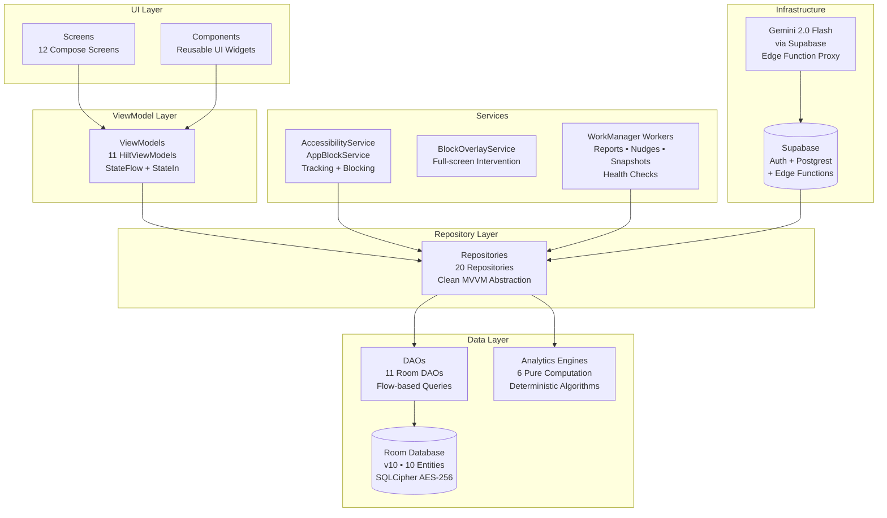
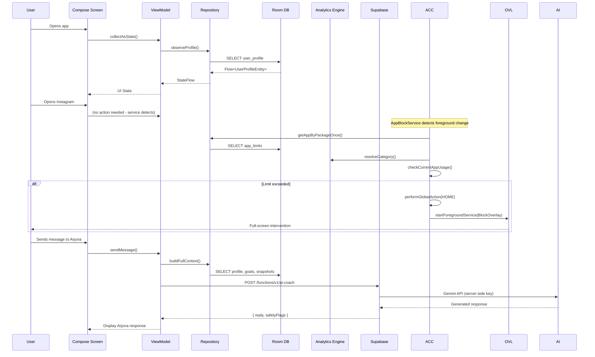
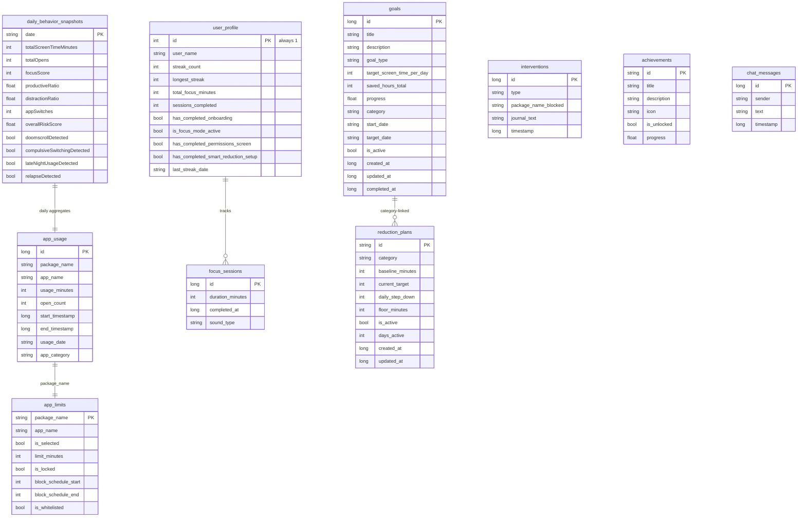
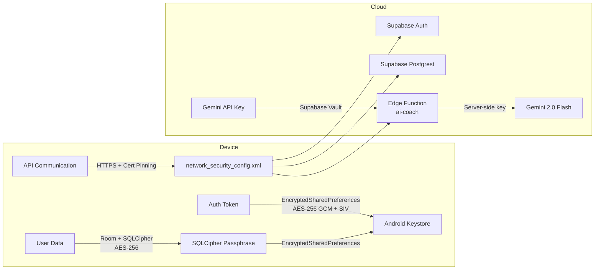

# FocusShield

<div align="center">

[](https://kotlinlang.org/)
[](https://developer.android.com/)
[](https://developer.android.com/compose)
[](https://supabase.com)
[](https://ai.google.dev/)
[](https://dagger.dev/hilt/)
[](https://github.com)

**AI-powered digital behavior transformation platform for Android**

</div>

---

## Overview

FocusShield is not a simple app blocker. It is an **AI-powered personal digital discipline coach** that helps users overcome smartphone addiction through five pillars:

| # | Pillar | Description |
|---|---|---|
| **1** | **Awareness** | Understand your digital behavior with precision tracking |
| **2** | **Intervention** | Detect distraction moments and intelligently intervene |
| **3** | **Replacement** | Provide productive alternatives instead of just blocking |
| **4** | **Improvement** | Help you gradually build healthier digital habits |
| **5** | **Growth** | Connect reduced screen time with meaningful life goals |

---

## Architecture


```mermaid
graph TB
    subgraph "UI Layer"
        SCR[Screens<br/>12 Compose Screens]
        CMP[Components<br/>Reusable UI Widgets]
    end

    subgraph "ViewModel Layer"
        VM[ViewModels<br/>11 HiltViewModels<br/>StateFlow + StateIn]
    end

    subgraph "Repository Layer"
        REPO[Repositories<br/>20 Repositories<br/>Clean MVVM Abstraction]
    end

    subgraph "Data Layer"
        DAO[DAOs<br/>11 Room DAOs<br/>Flow-based Queries]
        DB[(Room Database<br/>v10 • 10 Entities<br/>SQLCipher AES-256)]
        ENG[Analytics Engines<br/>6 Pure Computation<br/>Deterministic Algorithms]
    end

    subgraph "Services"
        ACC[AccessibilityService<br/>AppBlockService<br/>Tracking + Blocking]
        OVL[BlockOverlayService<br/>Full-screen Intervention]
        WRK[WorkManager Workers<br/>Reports • Nudges • Snapshots<br/>Health Checks]
    end

    subgraph "Infrastructure"
        SUP[(Supabase<br/>Auth + Postgrest<br/>+ Edge Functions)]
        AI[Gemini 2.0 Flash<br/>via Supabase<br/>Edge Function Proxy]
    end

    SCR --> VM
    CMP --> VM
    VM --> REPO
    REPO --> DAO
    REPO --> ENG
    DAO --> DB
    ACC --> REPO
    WRK --> REPO
    SUP --> REPO
    AI --> SUP
```

### Data Flow


```mermaid
sequenceDiagram
    participant User
    participant Screen as Compose Screen
    participant VM as ViewModel
    participant Repo as Repository
    participant Room as Room DB
    participant Engine as Analytics Engine
    participant Supabase as Supabase

    User->>Screen: Opens app
    Screen->>VM: collectAsState()
    VM->>Repo: observeProfile()
    Repo->>Room: SELECT user_profile
    Room-->>Repo: Flow<UserProfileEntity>
    Repo-->>VM: StateFlow
    VM-->>Screen: UI State

    User->>Screen: Opens Instagram
    Screen->>VM: (no action needed - service detects)
    Note over ACC: AppBlockService detects foreground change
    ACC->>Repo: getAppByPackageOnce()
    Repo->>Room: SELECT app_limits
    ACC->>Engine: resolveCategory()
    ACC->>ACC: checkCurrentAppUsage()

    alt Limit exceeded
        ACC->>ACC: performGlobalAction(HOME)
        ACC->>OVL: startForegroundService(BlockOverlay)
        OVL-->>User: Full-screen intervention
    end

    User->>Screen: Sends message to Arjuna
    Screen->>VM: sendMessage()
    VM->>Repo: buildFullContext()
    Repo->>Room: SELECT profile, goals, snapshots
    VM->>Supabase: POST /functions/v1/ai-coach
    Supabase->>AI: Gemini API (server-side key)
    AI-->>Supabase: Generated response
    Supabase-->>VM: { reply, safetyFlags }
    VM-->>Screen: Display Arjuna response
```

---

## Database Schema


```mermaid
erDiagram
    user_profile {
        int id PK "always 1"
        string user_name
        int streak_count
        int longest_streak
        int total_focus_minutes
        int sessions_completed
        bool has_completed_onboarding
        bool is_focus_mode_active
        bool has_completed_permissions_screen
        bool has_completed_smart_reduction_setup
        string last_streak_date
    }

    app_limits {
        string package_name PK
        string app_name
        bool is_selected
        int limit_minutes
        bool is_locked
        int block_schedule_start
        int block_schedule_end
        bool is_whitelisted
    }

    app_usage {
        long id PK
        string package_name
        string app_name
        int usage_minutes
        int open_count
        long start_timestamp
        long end_timestamp
        string usage_date
        string app_category
    }

    daily_behavior_snapshots {
        string date PK
        int totalScreenTimeMinutes
        int totalOpens
        int focusScore
        float productiveRatio
        float distractionRatio
        int appSwitches
        float overallRiskScore
        bool doomscrollDetected
        bool compulsiveSwitchingDetected
        bool lateNightUsageDetected
        bool relapseDetected
    }

    focus_sessions {
        long id PK
        int duration_minutes
        long completed_at
        string sound_type
    }

    goals {
        long id PK
        string title
        string description
        string goal_type
        int target_screen_time_per_day
        int saved_hours_total
        float progress
        string category
        string start_date
        string target_date
        bool is_active
        long created_at
        long updated_at
        long completed_at
    }

    interventions {
        long id PK
        string type
        string package_name_blocked
        string journal_text
        long timestamp
    }

    achievements {
        string id PK
        string title
        string description
        string icon
        bool is_unlocked
        float progress
    }

    reduction_plans {
        string id PK
        string category
        int baseline_minutes
        int current_target
        int daily_step_down
        int floor_minutes
        bool is_active
        int days_active
        long created_at
        long updated_at
    }

    chat_messages {
        long id PK
        string sender
        string text
        long timestamp
    }

    app_usage ||--|| app_limits : "package_name"
    user_profile ||--o{ focus_sessions : "tracks"
    goals ||--o{ reduction_plans : "category-linked"
    daily_behavior_snapshots ||--|| app_usage : "daily aggregates"
```

### Database Version History

| Version | Migration | Change |
|---|---|---|
| v1 | — | Initial: app_limits, focus_sessions, user_profile |
| v2 | MIGRATION_1_2 | Added app_usage table with composite index |
| v3 | MIGRATION_2_3 | Added daily_behavior_snapshots |
| v4 | MIGRATION_3_4 | Added goals (single-row) |
| v5 | MIGRATION_4_5 | Added interventions |
| v6 | MIGRATION_5_6 | Added achievements |
| v7 | MIGRATION_6_7 | Added chat_messages |
| v8 | MIGRATION_7_8 | Added reduction_plans |
| v9 | MIGRATION_8_9 | Extended user_profile (onboarding flags, streak date) |
| **v10** | MIGRATION_9_10 | Rewrote goals → multi-row personal goal system |

---

## Feature Matrix

| Feature | Components | AI-Powered | Offline |
|---|---|---|---|
| **Real-time Usage Tracking** | AppBlockService (AccessibilityService), UsageStatsManager confirmation, dual-clock timing | — | ✅ |
| **Behavioral Intelligence** | 6 signal detection engines (doomscroll, compulsive switching, late-night, addiction spike, productivity decay, relapse) | — | ✅ |
| **Smart Blocking** | Priority-based (Schedule → Focus → Category → App Limit), BlockOverlayService | — | ✅ |
| **Intervention System** | Breathing exercise, Journaling, Affirmations | — | ✅ |
| **Focus Timer** | Pomodoro (6 durations), 5 ambient sounds, lock mode, session persistence | — | ✅ |
| **Adaptive Reduction** | Category-based plans, success-rate-aware roadmap (5/10/12%), goal-aware floor | — | ✅ |
| **Analytics Dashboard** | Focus scores, category breakdowns, hourly heatmaps, trends (7-day, 30-day), addiction profile | — | ✅ |
| **AI Coach (Arjuna)** | Gemini 2.0 Flash via Supabase Edge Function, 6-repository context injection, conversation memory | ✅ | ❌ |
| **Goal Management** | 5 types (Learning, Fitness, Career, Creative, Custom), saved-hours calculation, progress tracking | — | ✅ |
| **Gamification** | 10 achievements, streaks with recovery logic, streak engine | — | ✅ |
| **Authentication** | Supabase email/password, EncryptedSharedPreferences, deep-link verification | — | ❌ |

---

## Tech Stack

| Layer | Technology | Version |
|---|---|---|
| **Language** | Kotlin | 2.0.21 |
| **UI Framework** | Jetpack Compose (Material 3) | BOM 2024.12 |
| **Navigation** | Navigation Compose | 2.8.9 |
| **Architecture** | MVVM + Clean Architecture + Repository Pattern | — |
| **DI** | Hilt (Dagger) | 2.51.1 |
| **Database** | Room + SQLCipher (AES-256) | 2.6.1 / 4.5.4 |
| **Reactive** | Kotlin Coroutines + StateFlow | 1.8.1 |
| **Background** | WorkManager | 2.9.1 |
| **Backend** | Supabase (Auth + Postgrest + Edge Functions) | 3.1.4 |
| **AI** | Google Gemini 2.0 Flash (via Edge Function proxy) | Server-side |
| **HTTP** | Ktor OkHttp (via Supabase-kt) | 3.1.1 |
| **Serialization** | Kotlinx Serialization + Gson | 1.7.3 / 2.10.1 |
| **Security** | Jetpack Security Crypto, SQLCipher, EncryptedSharedPreferences | 1.1.0-alpha06 |
| **Crash Reporting** | Firebase Crashlytics (optional, graceful degradation) | BoM 33.6.0 |
| **Testing** | JUnit 4, Espresso, Compose UI Test | 4.13.2 |

### Dependencies

```toml
[versions]
agp = "8.7.3"
kotlin = "2.0.21"
ksp = "2.0.21-1.0.28"
coreKtx = "1.15.0"
composeBom = "2024.12.01"
navigationCompose = "2.8.9"
hilt = "2.51.1"
room = "2.6.1"
coroutines = "1.8.1"
supabase = "3.1.4"
ktor = "3.1.1"
securityCrypto = "1.1.0-alpha06"
```

---

## Security Architecture


```mermaid
graph LR
    subgraph "Device"
        A[Auth Token] -->|EncryptedSharedPreferences<br/>AES-256 GCM + SIV| B[Android Keystore]
        C[User Data] -->|Room + SQLCipher<br/>AES-256| D[SQLCipher Passphrase]
        D -->|EncryptedSharedPreferences| B
        E[API Communication] -->|HTTPS + Cert Pinning| F[network_security_config.xml]
    end

    subgraph "Cloud"
        G[Supabase Auth] 
        H[Supabase Postgrest]
        I[Edge Function<br/>ai-coach]
        J[Gemini API Key]
        K[Gemini 2.0 Flash]
    end

    F --> G
    F --> H
    F --> I
    I -->|Server-side key| K
    J -->|Supabase Vault| I
```

| Security Feature | Implementation |
|---|---|
| **Auth token storage** | EncryptedSharedPreferences (AES-256 GCM + SIV, backed by Android Keystore) |
| **Database encryption** | SQLCipher AES-256, passphrase in EncryptedSharedPreferences |
| **Network security** | HTTPS enforced, cleartext rejected, certificate pinning for supabase.co |
| **API key protection** | Gemini key stored in Supabase Vault, never in APK — accessed via Edge Function proxy |
| **Prompt sanitization** | Server-side prompt injection prevention in Edge Function |
| **Response filtering** | Content safety check for self-harm, violence, dangerous content in Edge Function |
| **Rate limiting** | 10 messages/client session, 20 requests/minute/server |
| **Backup rules** | Auth tokens + DB passphrase excluded from backups |

---

## Project Structure

```
AddictionReductionApp/
├── app/
│   ├── src/
│   │   ├── main/
│   │   │   ├── java/com/example/addictionreductionapp/
│   │   │   │   ├── components/            # Reusable Compose components
│   │   │   │   │   ├── CommonComponents.kt
│   │   │   │   │   └── ComplianceDialog.kt
│   │   │   │   ├── data/
│   │   │   │   │   ├── ai/                # AI context builder (M6)
│   │   │   │   │   │   └── CoachContextBuilder.kt
│   │   │   │   │   ├── analytics/         # 6 behavioral engines
│   │   │   │   │   │   ├── AchievementEngine.kt
│   │   │   │   │   │   ├── BehavioralIntelligenceEngine.kt
│   │   │   │   │   │   ├── FocusScoreEngine.kt
│   │   │   │   │   │   ├── GoalProgressEngine.kt
│   │   │   │   │   │   ├── SmartReductionEngine.kt
│   │   │   │   │   │   └── StreakEngine.kt
│   │   │   │   │   ├── local/
│   │   │   │   │   │   ├── converters/    # Room TypeConverters
│   │   │   │   │   │   ├── dao/           # 11 Room DAOs
│   │   │   │   │   │   ├── database/      # AppDatabase + DatabaseModule + DatabaseSecurity
│   │   │   │   │   │   └── entities/      # 10 Room Entities
│   │   │   │   │   ├── models/            # 8 pure data models
│   │   │   │   │   └── repository/        # 20 repositories
│   │   │   │   ├── di/                    # Hilt DI modules
│   │   │   │   ├── screens/               # 12 Compose screens
│   │   │   │   │   ├── auth/              # Login + Register
│   │   │   │   │   ├── analytics/         # Dashboard sub-sections
│   │   │   │   │   ├── AICoachScreen.kt
│   │   │   │   │   ├── AnalyticsScreen.kt
│   │   │   │   │   ├── AppBlockerScreen.kt
│   │   │   │   │   ├── BlockScreen.kt
│   │   │   │   │   ├── BottomNavigationBar.kt
│   │   │   │   │   ├── FocusTimerScreen.kt
│   │   │   │   │   ├── GoalsScreen.kt
│   │   │   │   │   ├── HomeScreen.kt
│   │   │   │   │   ├── OnboardingScreen.kt
│   │   │   │   │   ├── PermissionScreen.kt
│   │   │   │   │   ├── PrivacyPolicyScreen.kt
│   │   │   │   │   ├── ProfileScreen.kt
│   │   │   │   │   ├── RoadmapScreen.kt
│   │   │   │   │   └── SmartReductionSetupScreen.kt
│   │   │   │   ├── ui/theme/             # Compose theme + colors
│   │   │   │   ├── utils/                # PermissionUtils, SessionManager, etc.
│   │   │   │   ├── viewmodel/            # 11 ViewModels
│   │   │   │   ├── MainActivity.kt       # Single Activity entry point
│   │   │   │   ├── SmartFocusApp.kt      # Application class
│   │   │   │   ├── AppBlockService.kt    # Accessibility service
│   │   │   │   ├── BlockOverlayService.kt # Foreground overlay service
│   │   │   │   ├── BootReceiver.kt       # Boot completion handler
│   │   │   │   └── *Worker.kt            # WorkManager workers (4)
│   │   │   ├── res/
│   │   │   │   ├── xml/
│   │   │   │   │   ├── network_security_config.xml
│   │   │   │   │   ├── backup_rules.xml
│   │   │   │   │   ├── data_extraction_rules.xml
│   │   │   │   │   └── accessibility_service_config.xml
│   │   │   │   └── values/
│   │   │   │       ├── strings.xml
│   │   │   │       ├── colors.xml
│   │   │   │       └── themes.xml
│   │   │   └── AndroidManifest.xml
│   │   ├── test/                          # Unit tests (66 tests, 8 classes)
│   │   └── androidTest/                   # Instrumented tests
│   ├── build.gradle.kts
│   └── proguard-rules.pro
├── supabase/
│   └── functions/
│       └── ai-coach/
│           └── index.ts                  # Gemini proxy Edge Function
├── docs/
│   ├── FINAL_AUDIT_REPORT.md
│   ├── IMPLEMENTATION_PLAN.md
│   └── MANUAL_SETUP_GUIDE.md
├── build.gradle.kts                       # Root build script
├── settings.gradle.kts
└── gradle/
    └── libs.versions.toml                 # Version catalog
```

### Stats

| Metric | Value |
|---|---|
| **Kotlin files** | 111 |
| **XML resources** | 12 |
| **Test files** | 8 (66 unit tests) |
| **Room entities** | 10 |
| **Room DAOs** | 11 |
| **Repositories** | 20 |
| **ViewModels** | 11 |
| **Compose screens** | 16 |
| **Analytics engines** | 6 |
| **WorkManager workers** | 4 |
| **Database migrations** | 9 (v1 → v10) |
| **Edge functions** | 1 |

---

## Getting Started

### Prerequisites

- **Android Studio** Hedgehog (2023.1) or later
- **JDK 21** (Eclipse Adoptium recommended)
- **Android SDK** API 36
- **Gradle** 8.12+ (wrapper included)
- **Supabase** account (free tier)
- **Google Gemini API key** (for AI coach)

### Quick Setup

```bash
# 1. Clone the repository
git clone https://github.com/your-org/smartfocus.git
cd smartfocus

# 2. Create local.properties
echo "SUPABASE_URL=https://your-project.supabase.co" > local.properties
echo "SUPABASE_ANON_KEY=your-anon-key" >> local.properties

# 3. Build and run
./gradlew assembleDebug
adb install app/build/outputs/apk/debug/app-debug.apk
```

### Supabase Setup

```bash
# 1. Deploy the AI Coach Edge Function
supabase functions deploy ai-coach --no-verify-jwt

# 2. Set the Gemini API key (stored in Supabase Vault)
supabase secrets set GEMINI_API_KEY=your-gemini-api-key

# 3. Verify
curl -X POST https://YOUR_PROJECT.supabase.co/functions/v1/ai-coach \
  -H "Content-Type: application/json" \
  -d '{"prompt": "Hello"}'
```

### Firebase (Optional — Crash Reporting)

1. Create a Firebase project at [console.firebase.google.com](https://console.firebase.google.com)
2. Add Android app with package `com.example.addictionreductionapp`
3. Download `google-services.json` → place in `app/`
4. Uncomment Google Services plugin in Gradle files
5. Crashlytics auto-initialises via ContentProvider

### Release Build

```bash
# 1. Generate keystore
keytool -genkey -v -keystore smartfocus-release.keystore \
  -alias smartfocus -keyalg RSA -keysize 2048 -validity 10000

# 2. Set environment variables
export KEYSTORE_PASSWORD="your-password"
export KEY_PASSWORD="your-password"

# 3. Build
./gradlew assembleRelease

# 4. Verify security
strings app/build/outputs/apk/release/app-release.apk | grep -i "AIzaSy\|sk-"
# Expected: NO OUTPUT (no API keys exposed)
```

---

## Permissions

| Permission | Purpose | Required |
|---|---|---|
| `PACKAGE_USAGE_STATS` | Historical usage data for baseline calculation and smart reduction setup | ✅ |
| `BIND_ACCESSIBILITY_SERVICE` | Detect foreground apps for real-time tracking and blocking | ✅ |
| `SYSTEM_ALERT_WINDOW` | Show full-screen blocking overlay when limits are reached | ✅ |
| `FOREGROUND_SERVICE` + `SPECIAL_USE` | Keep the blocking overlay and accessibility service active in the background | ✅ |
| `INTERNET` | Supabase backend communication and AI coach requests | ✅ |
| `POST_NOTIFICATIONS` | Nudge notifications, daily/weekly reports, health alerts | ✅ |
| `RECEIVE_BOOT_COMPLETED` | Re-schedule background workers after device reboot | ✅ |
| `QUERY_ALL_PACKAGES` | App category classification for personalized reduction plans | ✅ |
| `REQUEST_IGNORE_BATTERY_OPTIMIZATIONS` | Prevent OEM battery optimization from killing accessibility service | ✅ |

---

## Testing

```bash
# Run unit tests (66 tests, 8 classes)
./gradlew testDebugUnitTest
```

| Test Suite | Tests | Covers |
|---|---|---|
| `AchievementEngineTest` | 14 | All 10 achievements (unlock conditions, progress, edge cases) |
| `BehavioralIntelligenceEngineTest` | 11 | 6 signal detectors (doomscroll, compulsive, late-night, spike, decay, relapse) |
| `GoalProgressEngineTest` | 6 | Goal progress calculation + insight generation |
| `FocusScoreEngineTest` | 5 | Score calculation (empty, productive, distracting, switching, clamping) |
| `StreakEngineTest` | 8 | Streak calculation with recovery logic, gaps, longest tracking |
| `SmartReductionEngineTest` | 13 | Baseline computation + adaptive roadmap (rate, floor, milestones) |
| `AdaptiveReductionRepositoryTest` | 8 | Week target calculation + success rate computation |
| `ExampleUnitTest` | 1 | Placeholder |

---

## Play Store Compliance

| Requirement | Status |
|---|---|
| Privacy Policy | ✅ [Hosted](https://sujalcodes1.github.io/smartfocus-privacy/) + in-app screen |
| Account Deletion | ✅ Local deletion + sign-out (Play-compliant) |
| Accessibility Disclosure | ✅ Dialog shown before permissions grant |
| AI Content Labeling | ✅ "AI-generated" label + report button on all Arjuna messages |
| Data Safety | ✅ All data types documented, encrypted in transit + at rest |
| QUERY_ALL_PACKAGES Declaration | 📋 Form prepared |
| FOREGROUND_SERVICE Declaration | 📋 Form prepared |

---

## Roadmap

| Phase | Features | Status |
|---|---|---|
| v1.0 | Core tracking, blocking, intervention, focus timer | ✅ |
| v1.1 | Adaptive roadmap, multi-row goals, AI context injection, accessibility persistence | ✅ |
| v1.2 | Server-side account deletion, multi-session AI memory | 🔜 |
| v1.3 | Goal milestone sub-tasks, proactive alerts, type-specific AI recommendations | 📋 |
| v2.0 | Social features, multi-device sync, wearable integration | 💡 |

---

## Documentation

| Document | Description |
|---|---|
| [FINAL_AUDIT_REPORT.md](docs/FINAL_AUDIT_REPORT.md) | Complete production readiness audit (all 13 features scored) |
| [IMPLEMENTATION_PLAN.md](docs/IMPLEMENTATION_PLAN.md) | 9-milestone dependency-aware execution plan |
| [MANUAL_SETUP_GUIDE.md](docs/MANUAL_SETUP_GUIDE.md) | Supabase, Firebase, Play Store — all manual infrastructure steps |

---

## License

MIT © 2026 FocusShield Contributors

---

<div align="center">
  Built with Kotlin • Android • Supabase • Gemini
</div>
